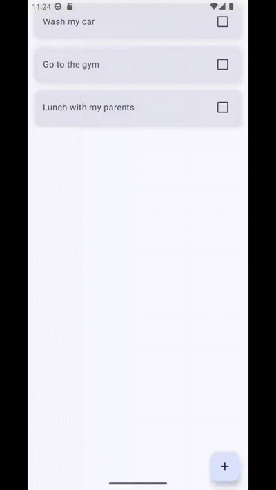

# 👋 Hi there! My name is Camilo.

### I'm a Junior Kotlin App Developer, passionate about creating intuitive and functional mobile experiences. Currently developing applications using Jetpack Compose and following Clean Architecture practices. Committed to continuous learning and collaborating on open-source projects. 🚀

## Skills:

 
 
 

## Languages Spoken:
- Spanish (Native)
- English (Intermediate B1)

## Some Projects:

| [Product Lister App](https://github.com/mcamilosanchez/Compose-Product-Lister-Clean-MVVM)                                           | [Todo App](https://github.com/ArisGuimera/SimpleAndroidMVVM)                                           |
|------------------------------------------------------------------------------------------------------------------------------------|--------------------------------------------------------------------------------------------------------|
| 

 | 

 |
| This application implements a product listing feature using **Jetpack Compose** and follows the **Clean MVVM** architecture.       | A simple task management application that follows the **MVVM** pattern, showcasing basic CRUD operations for tasks. |
| 
 
 | 
 
 |

## Contact me:

